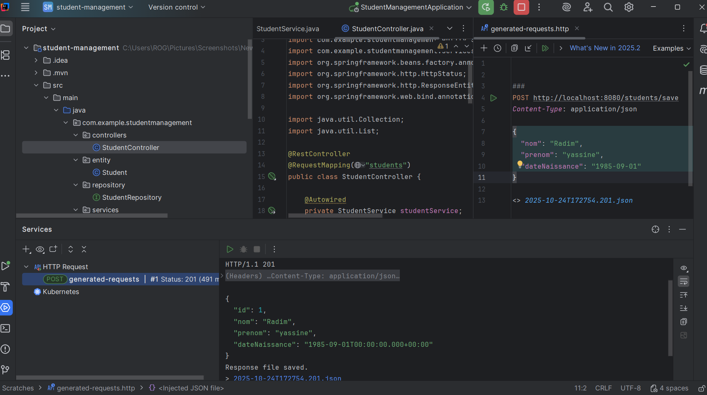
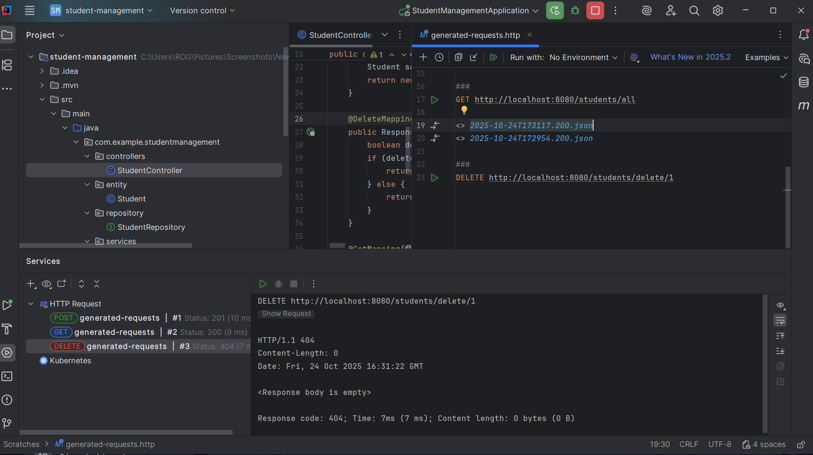
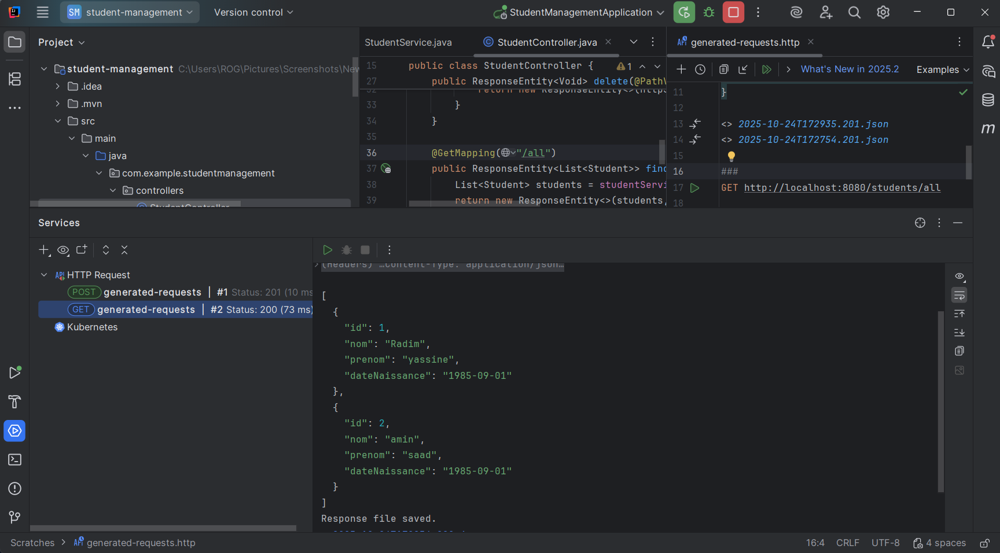
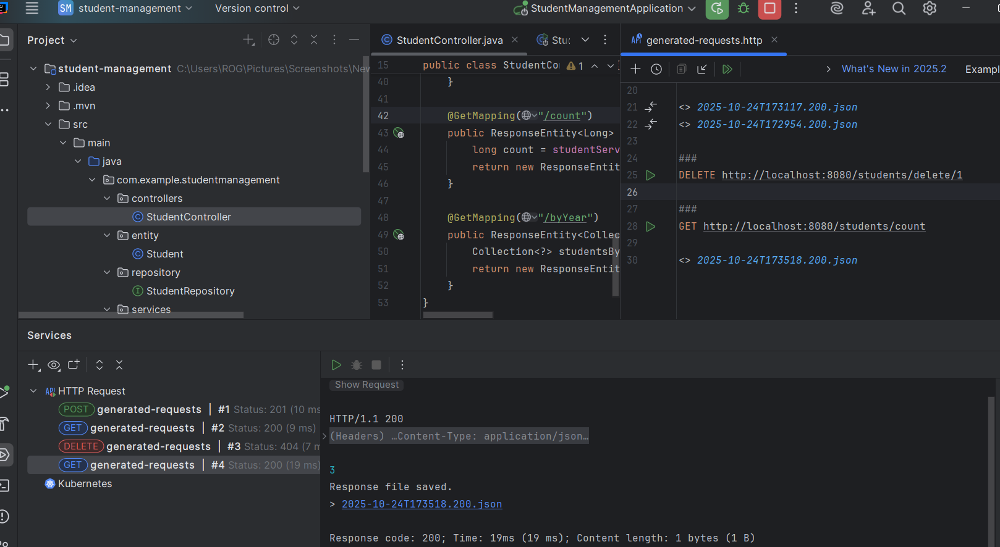
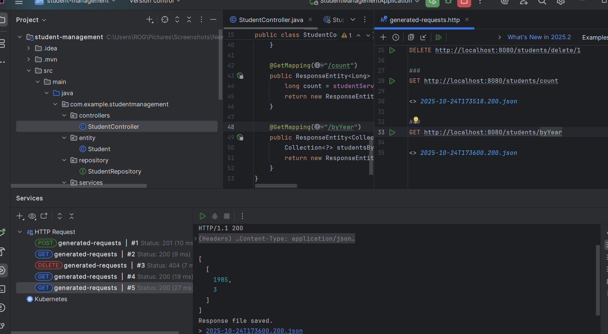
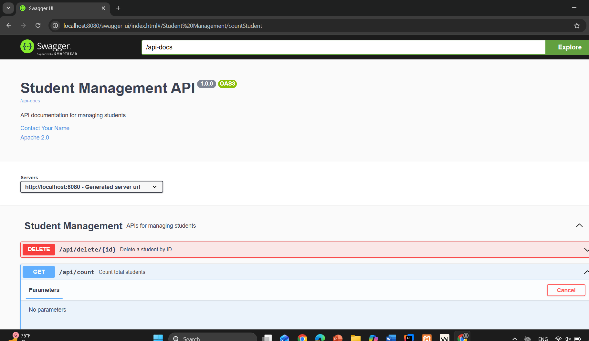

tudent Management API

A simple Spring Boot REST API for managing students — create, delete, list, count, and group by year.

📍 Base URL
http://localhost:8080/students

🧩 API Endpoints
➕ Add a New Student

URL:
POST /students/save
Description:
Adds a new student to the database.

❌ Delete a Student

URL:
DELETE /students/delete/{id}
Description:
Deletes a student by their unique ID.

Replace {id} with the student’s ID.

Returns 204 if deleted successfully or 404 if not found.

📋 Get All Students

URL:
GET /students/all
Description:
Retrieves a list of all students stored in the system.

🔢 Count Total Students

URL:
GET /students/count
Description:
Returns the total number of students in the database.

📊 Get Students by Year

URL:
GET /students/byYear
Description:
Returns the number of students grouped by academic year."# TP-6-Spring-Boot-et-Swagger" 

## 🧪 Unit Tests

##  Intégration de Swagger
wagger (via springdoc-openapi) est un outil puissant pour documenter les API REST et fournir une interface interactive permettant de tester les endpoints directement depuis le navigateur.
Grâce à Spring Boot, il est possible de configurer Swagger automatiquement pour générer une documentation complète et claire de toutes les routes exposées par les contrôleurs REST.
Cette section décrit pas à pas comment intégrer et utiliser Swagger dans un projet Spring Boot.

